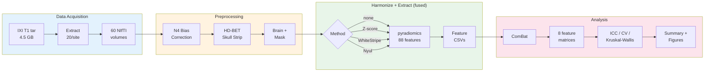
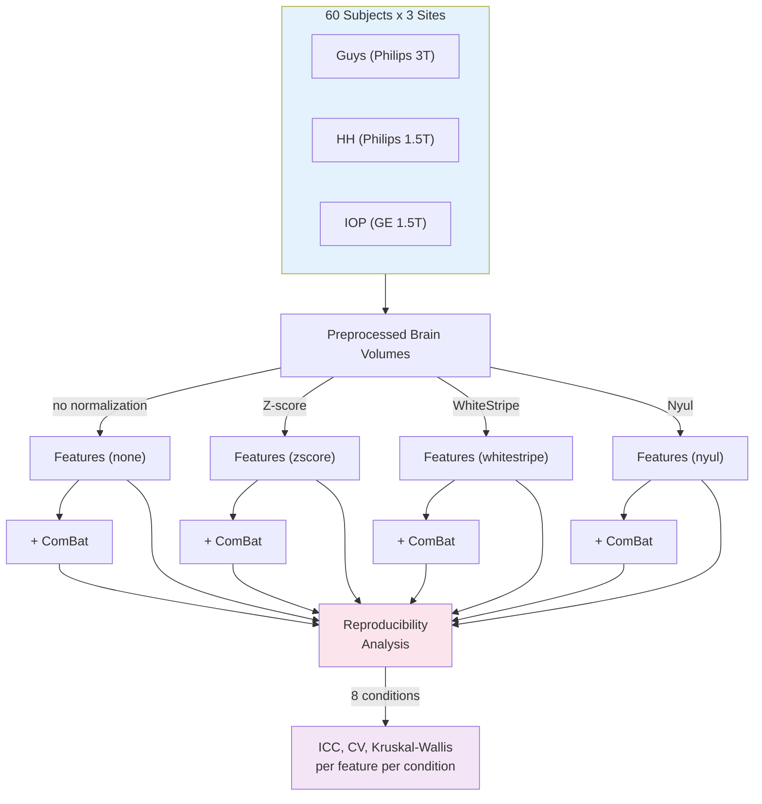

# MRI Harmonization Benchmark for Radiomics Reproducibility

A benchmarking pipeline that quantitatively compares MRI intensity harmonization methods for radiomics feature reproducibility across scanner sites. Uses the public [IXI dataset](https://brain-development.org/ixi-dataset/) (three London hospitals, different manufacturers and field strengths), applies image-level and feature-level harmonization, extracts 88 radiomics features per subject, and measures which methods stabilize which feature classes.

## Key Finding

Image-level normalization (Z-score, WhiteStripe, Nyul) makes intensities *look* more comparable but does **not** significantly improve radiomics feature reproducibility. Feature-level ComBat is consistently more effective. The combination of image-level normalization + ComBat eliminates virtually all site effects.

| Condition | Reproducible Features | Median Repro. Index | Significant Site Effects |
|-----------|----------------------|---------------------|------------------------|
| None (baseline) | 30% | 0.53 | 84/88 |
| Z-score | 14% | 0.46 | 82/88 |
| WhiteStripe | 27% | 0.56 | 79/88 |
| Nyul | 18% | 0.44 | 81/88 |
| ComBat only | 100% | 0.99 | 30/88 |
| Z-score + ComBat | 100% | 1.00 | 0/88 |
| WhiteStripe + ComBat | 100% | 0.99 | 0/88 |
| Nyul + ComBat | 100% | 0.99 | 1/88 |

## Dataset

**IXI (Information eXtraction from Images)** -- ~600 healthy subject brain MRIs from three London hospitals:

- **Guys Hospital** -- Philips 3T
- **Hammersmith Hospital (HH)** -- Philips 1.5T
- **Institute of Psychiatry (IOP)** -- GE 1.5T

The pipeline uses 20 T1-weighted subjects per site (60 total). License: CC BY-SA 3.0.

## Pipeline



```
mri-harmonize download       # Download IXI T1 (~4.5 GB tar), extract 20/site, delete tar
mri-harmonize preprocess     # N4 bias field correction + HD-BET brain extraction
mri-harmonize harmonize      # Image normalization + radiomics feature extraction (fused)
mri-harmonize combat         # ComBat batch-effect correction on feature matrices
mri-harmonize analyze        # ICC, CV, Kruskal-Wallis reproducibility metrics
mri-harmonize visualize      # Histograms, violin plots, ICC heatmap, summary chart
```

Each stage reads from disk and writes to disk, so stages can be run independently. Normalized volumes are never written to disk -- harmonization and feature extraction are fused to control disk usage (peak ~1.5 GB).

## Setup

Requires Python >= 3.12 and [uv](https://docs.astral.sh/uv/).

```bash
git clone <repo-url>
cd mri-harmonization-benchmark
uv sync
```

### Run the full pipeline

```bash
uv run mri-harmonize download --subjects-per-site 20
uv run mri-harmonize preprocess --device mps    # use 'cpu' if no Apple Silicon
uv run mri-harmonize harmonize --method none     # baseline (no normalization)
uv run mri-harmonize harmonize --method zscore
uv run mri-harmonize harmonize --method whitestripe
uv run mri-harmonize harmonize --method nyul
uv run mri-harmonize combat
uv run mri-harmonize analyze
uv run mri-harmonize visualize
```

Preprocessing takes ~25 minutes on Apple M4 Pro (N4 correction + HD-BET skull stripping). Feature extraction takes ~5 minutes per method. Everything else is seconds.

### Run tests

```bash
uv run pytest
uv run pytest --cov    # with coverage report (92%, 84 tests)
```

## Project Structure

```
src/mri_harmonization/
    types.py                        # Domain types: Site, Subject, HarmonizationMethod
    config.py                       # Pipeline configuration and paths
    acquisition/                    # IXI download, manifest CSV, demographics
    preprocessing/                  # N4 bias correction (SimpleITK), HD-BET brain extraction
    harmonization/
        base.py                     # ImageHarmonizer protocol
        image_level.py              # Z-score, WhiteStripe, Nyul implementations
        feature_level.py            # ComBat via neuroCombat
    features/
        extractor.py                # pyradiomics wrapper (88 features per subject)
        io.py                       # Feature matrix CSV I/O
    analysis/                       # Reproducibility index, CV, Kruskal-Wallis, summary
    visualization/                  # Histograms, violin plots, ICC heatmaps, bar charts
    cli.py                          # CLI entry points
tests/
    conftest.py                     # Synthetic NIfTI fixtures
    unit/                           # 84 tests across all modules
```

## Experimental Design



## Methods

### Image-Level Harmonization

- **Z-score**: Standardizes brain voxel intensities to zero mean, unit variance within the brain mask
- **WhiteStripe**: Identifies the white matter intensity peak and normalizes relative to it
- **Nyul**: Piecewise linear histogram matching -- fits a standard histogram from the population, then maps each image's percentiles to the standard scale

### Feature-Level Harmonization

- **ComBat**: Empirical Bayes batch-effect correction (neuroCombat). Estimates site-specific location and scale parameters, removes them while preserving biological covariates (age, sex)

### Reproducibility Metrics

- **Reproducibility Index**: 1 - eta-squared (proportion of variance NOT explained by site). Values > 0.75 = reproducible
- **Kruskal-Wallis H-test**: Non-parametric test for significant differences across sites (p < 0.05 = site effect)
- **Coefficient of Variation**: Relative variability (std / mean)

## Dependencies

Core: nibabel, SimpleITK, pyradiomics (from GitHub master), neuroCombat, HD-BET, numpy, scipy, pandas, matplotlib, seaborn, pingouin

pyradiomics is installed from [GitHub master](https://github.com/AIM-Harvard/pyradiomics) for Python 3.12 compatibility.

## Outputs

After a full run, `data/results/` contains:

- `summary.csv` -- one row per harmonization condition with aggregate metrics
- `*_metrics.csv` -- per-feature reproducibility metrics for each condition
- `figures/` -- 14 PNG figures:
  - `reproducibility_summary.png` -- bar chart of % reproducible features per condition
  - `icc_heatmap.png` -- features x conditions heatmap
  - `intensity_histograms.png` -- raw intensity distributions by site
  - `intensity_histograms_{method}.png` -- post-normalization distributions
  - `violin_{condition}_{raw,combat}.png` -- feature distributions before/after ComBat
